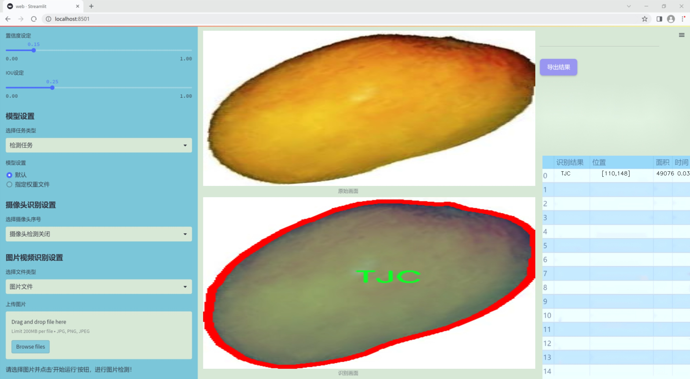
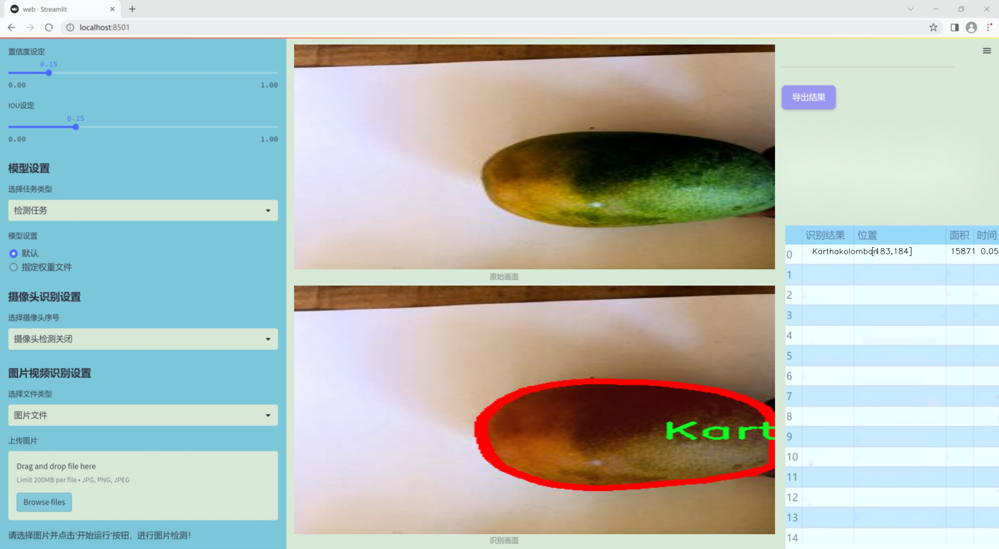
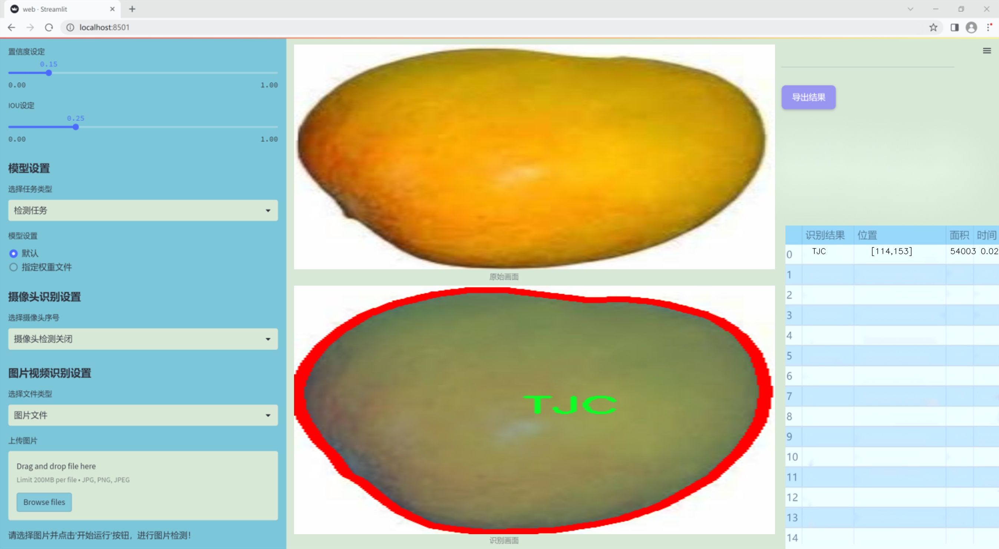
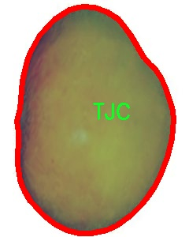
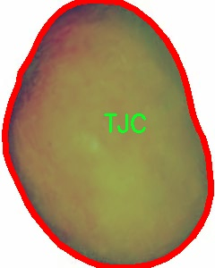
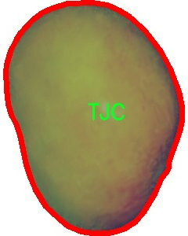
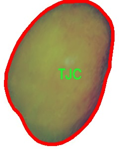
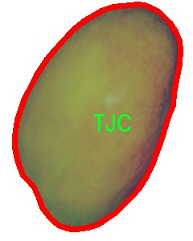

### 1.背景意义

研究背景与意义

随着全球农业科技的迅速发展，智能化农业逐渐成为提升农作物生产效率和质量的重要手段。芒果作为一种受欢迎的热带水果，其品种多样性和市场需求日益增加。然而，传统的芒果品种识别方法往往依赖于人工经验，不仅效率低下，而且容易受到主观因素的影响。因此，开发一种高效、准确的芒果品种识别系统显得尤为重要。

本研究旨在基于改进的YOLOv11模型，构建一个针对芒果品种的识别系统。该系统将利用包含1400张图像的MangoWise数据集，涵盖三种主要芒果品种：Karthakolomban、Petti Aba和TJC。通过对这些图像进行实例分割和深度学习训练，系统能够实现对不同芒果品种的自动识别与分类。这不仅可以提高品种识别的准确性，还能大幅度提升农业生产管理的效率。

在现代农业中，准确的品种识别对于病虫害防治、产量预测和市场营销等环节都具有重要意义。通过自动化的识别系统，农民和农业管理者能够更快速地获取有关芒果品种的信息，从而做出更为科学的决策。此外，随着计算机视觉技术的不断进步，基于深度学习的图像识别方法将为农业的智能化转型提供强有力的技术支持。

本研究不仅具有重要的理论价值，还将为实际农业生产提供切实可行的解决方案。通过构建高效的芒果品种识别系统，我们希望能够推动农业科技的进步，助力可持续农业的发展，为全球食品安全和生态环境保护贡献一份力量。

### 2.视频效果

[2.1 视频效果](https://www.bilibili.com/video/BV1QQk7YJEzd/)

### 3.图片效果







##### [项目涉及的源码数据来源链接](https://kdocs.cn/l/cszuIiCKVNis)**

注意：本项目提供训练的数据集和训练教程,由于版本持续更新,暂不提供权重文件（best.pt）,请按照6.训练教程进行训练后实现上图演示的效果。

### 4.数据集信息

##### 4.1 本项目数据集类别数＆类别名

nc: 3
names: ['Karthakolomban', 'Petti Aba', 'TJC']


该项目为【图像分割】数据集，请在【训练教程和Web端加载模型教程（第三步）】这一步的时候按照【图像分割】部分的教程来训练

##### 4.2 本项目数据集信息介绍

本项目数据集信息介绍

本项目旨在通过改进YOLOv11模型，提升芒果品种的识别精度与效率。为此，我们构建了一个名为“MangoWise”的数据集，该数据集专注于三种主要的芒果品种，分别为Karthakolomban、Petti Aba和TJC。这三种芒果品种在外观、形状和颜色上具有显著的差异性，因而为模型的训练提供了丰富的特征信息。

“MangoWise”数据集的构建过程涵盖了多个阶段，包括数据采集、标注和预处理。我们从多个种植园和市场收集了大量的芒果样本，确保数据的多样性和代表性。在标注过程中，采用了精确的框选技术，对每一种芒果品种进行了详细的标注，以便模型能够学习到每种品种的独特特征。此外，为了增强模型的泛化能力，我们还进行了数据增强处理，包括旋转、缩放和颜色调整等操作。

该数据集不仅包含了不同成熟度和生长环境下的芒果样本，还涵盖了不同光照条件下的图像，以模拟实际应用场景中的复杂性。这种多样化的数据来源将有助于提升YOLOv11模型在实际应用中的鲁棒性和准确性。通过对“MangoWise”数据集的深入分析与训练，我们期望能够实现对芒果品种的高效识别，从而为农业生产和市场销售提供更为精准的支持。

总之，“MangoWise”数据集为本项目提供了坚实的基础，使得我们能够在芒果品种识别领域取得更大的突破与进展。随着研究的深入，我们相信该数据集将为未来的相关研究提供宝贵的参考和借鉴。











### 5.全套项目环境部署视频教程（零基础手把手教学）

[5.1 所需软件PyCharm和Anaconda安装教程（第一步）](https://www.bilibili.com/video/BV1BoC1YCEKi/?spm_id_from=333.999.0.0&vd_source=bc9aec86d164b67a7004b996143742dc)


[5.2 安装Python虚拟环境创建和依赖库安装视频教程（第二步）](https://www.bilibili.com/video/BV1ZoC1YCEBw?spm_id_from=333.788.videopod.sections&vd_source=bc9aec86d164b67a7004b996143742dc)

### 6.改进YOLOv11训练教程和Web_UI前端加载模型教程（零基础手把手教学）

[6.1 改进YOLOv11训练教程和Web_UI前端加载模型教程（第三步）](https://www.bilibili.com/video/BV1BoC1YCEhR?spm_id_from=333.788.videopod.sections&vd_source=bc9aec86d164b67a7004b996143742dc)


按照上面的训练视频教程链接加载项目提供的数据集，运行train.py即可开始训练



     Epoch   gpu_mem       box       obj       cls    labels  img_size
     1/200     20.8G   0.01576   0.01955  0.007536        22      1280: 100%|██████████| 849/849 [14:42<00:00,  1.04s/it]
               Class     Images     Labels          P          R     mAP@.5 mAP@.5:.95: 100%|██████████| 213/213 [01:14<00:00,  2.87it/s]
                 all       3395      17314      0.994      0.957      0.0957      0.0843

     Epoch   gpu_mem       box       obj       cls    labels  img_size
     2/200     20.8G   0.01578   0.01923  0.007006        22      1280: 100%|██████████| 849/849 [14:44<00:00,  1.04s/it]
               Class     Images     Labels          P          R     mAP@.5 mAP@.5:.95: 100%|██████████| 213/213 [01:12<00:00,  2.95it/s]
                 all       3395      17314      0.996      0.956      0.0957      0.0845

     Epoch   gpu_mem       box       obj       cls    labels  img_size
     3/200     20.8G   0.01561    0.0191  0.006895        27      1280: 100%|██████████| 849/849 [10:56<00:00,  1.29it/s]
               Class     Images     Labels          P          R     mAP@.5 mAP@.5:.95: 100%|███████   | 187/213 [00:52<00:00,  4.04it/s]
                 all       3395      17314      0.996      0.957      0.0957      0.0845


###### [项目数据集下载链接](https://kdocs.cn/l/cszuIiCKVNis)

### 7.原始YOLOv11算法讲解


##### YOLO11介绍

Ultralytics YOLO11是一款尖端的、最先进的模型，它在之前YOLO版本成功的基础上进行了构建，并引入了新功能和改进，以进一步提升性能和灵活性。
**YOLO11设计快速、准确且易于使用，使其成为各种物体检测和跟踪、实例分割、图像分类以及姿态估计任务的绝佳选择。**


**结构图如下：**


##### **C3k2**

**C3k2，结构图如下**


**C3k2，继承自类`C2f，其中通过c3k设置False或者Ture来决定选择使用C3k还是`**Bottleneck


**实现代码** **ultralytics/nn/modules/block.py**

##### C2PSA介绍

**借鉴V10 PSA结构，实现了C2PSA和C2fPSA，最终选择了基于C2的C2PSA（可能涨点更好？）**


**实现代码** **ultralytics/nn/modules/block.py**

##### Detect介绍

**分类检测头引入了DWConv（更加轻量级，为后续二次创新提供了改进点），结构图如下（和V8的区别）：**


### 8.200+种全套改进YOLOV11创新点原理讲解

#### 8.1 200+种全套改进YOLOV11创新点原理讲解大全

由于篇幅限制，每个创新点的具体原理讲解就不全部展开，具体见下列网址中的改进模块对应项目的技术原理博客网址【Blog】（创新点均为模块化搭建，原理适配YOLOv5~YOLOv11等各种版本）

[改进模块技术原理博客【Blog】网址链接](https://gitee.com/qunmasj/good)


#### 8.2 精选部分改进YOLOV11创新点原理讲解

###### 这里节选部分改进创新点展开原理讲解(完整的改进原理见上图和[改进模块技术原理博客链接](https://gitee.com/qunmasj/good)【如果此小节的图加载失败可以通过CSDN或者Github搜索该博客的标题访问原始博客，原始博客图片显示正常】



### Diverse Branch Block简介
参考该博客提出的一种通用的卷积网络构造块用来在不增加任何推理时间的前提下提升卷积网络的性能。我们将这个块命名为分离分支块（Diverse Branch Block）。通过结合不同尺寸和复杂度的分离分支（包括串联卷积、多尺度卷积和平均池化层）来增加特征空间的方法，它提升了单个卷积的表达能力。完成训练后，一个DBB(Diverse Branch Block)可以被等价地转换为一个单独的卷积操作以方便部署。不同于那些新颖的卷积结构的改进方式，DBB让训练时微结构复杂化同时维持大规模结构，因此我们可以将它作为任意结构中通用卷积层的一种嵌入式替代形式。通过这种方式，我们能够将模型训练到一个更高的表现水平，然后在推理时转换成原始推理时间的结构。

 
主要贡献点：

（1） 我们建议合并大量的微结构到不同的卷积结构中来提升性能，但是维持原始的宏观结构。

（2）我们提出DBB，一个通用构造块结构，概括六种转换来将一个DBB结构转化成一个单独卷积，因为对于用户来说它是无损的。

（3）我们提出一个Inception-like DBB结构实例(Fig 1)，并且展示它在ImageNet、COCO detection 和CityScapes任务中获得性能提升。


#### 结构重参数化
本文和一个并发网络RepVGG[1]是第一个使用结构重参数化来命名该思路------使用从其他结构转化来的参数确定当前结构的参数。一个之前的工作ACNet[2]也可以被划分为结构重参数化，它提出使用非对称卷积块来增强卷积核的结构（i.e 十字形结构）。相比于DBB，它被设计来提升卷积网络（在没有额外推理时间损失的条件下）。这个流水线也包含将一个训练好的模型转化为另一个。但是，ACNet和DBB的区别是：ACNet的思想被激发是基于一个观察，这个观察是网络结构的参数在过去有更大的量级，因此寻找方法让参数量级更大，然而我们关注一个不同的点。我们发现 平均池化、1x1 conv 和 1x1-kxk串联卷积是更有效的，因为它们提供了不同复杂度的路线，以及允许使用更多训练时非线性化。除此以外，ACB结构可以看作是DBB结构的一种特殊形式，因为那个1xk和kx1卷积层能够被扩大成kxk（via Transform VI(Fig.2)），然后合并成一个平方核（via Transform II）。

 

#### 分离分支结构
卷积的线性性
一个卷积操作可以表示为 ，其中为输入tensor, 为输出tensor。卷积核表示为一个四阶tensor , 偏置为。将加偏置的操作表示为。

因为，在第j个输出通道（h,w）位置的值可以由以下公式给出：，其中表示输入帧I的第c个通道上的一个滑动窗，对应输出帧O的坐标（h,w）。从上式可以看出，卷积操作具有齐次性和加法性。


注意：加法性成立的条件是两个卷积具有相同的配置（即通道数、核尺寸、步长和padding等）。

#### 分离分支的卷积
在这一小节，我们概括六种转换形式（Fig.2）来转换一个具有batch normalization(BN)、branch addition、depth concatenation、multi-scale operations、avarage pooling 和 sequences of convolutions的DBB分支。


Transform I：a conv for conv-BN  我们通常会给一个卷积配备配备一个BN层，它执行逐通道正则化和线性尺度放缩。设j为通道索引，分别为累积的逐通道均值和标准差，分别为学习的尺度因子和偏置项，对应输出通道j为


卷积的齐次性允许我们融合BN操作到前述的conv来做推理。在实践中，我们仅仅建立一个拥有卷积核和偏置, 用从原始BN序列的参数转换来的值来赋值。我们为每个输出通道j构造


Transform II a conv for branch addition  卷积的加法性确保如果有两个或者多个具有相同配置的卷积层相加，我们能够将它们合并到一个单独的卷积里面。对于conv-BN，我们应该首先执行Transform I。很明显的，通过下面的公式我们能够合并两个卷积


上述公式只有在两个卷积拥有相同配置时才成立。尽管合并上述分支能够在一定程度上增强模型，我们希望结合不同分支来进一步提升模型性能。在后面，我们介绍一些分支的形式，它们能够等价地被转化为一个单独的卷积。在通过多个转化来为每一个分支构造KxK的卷积之后，我们使用Transform II 将所有分支合并到一个conv里面。

Transform III: a conv for sequential convolutions   我们能够合并一个1x1 conv-BN-kxk conv序列到一个kxk conv里面。我们暂时假设卷积是稠密的（即 组数 groups=1）。组数groups>1的情形将会在Transform IV中实现。我们假定1x1和kxk卷积层的核形状分别是DxCx1x1和ExDxKxK，这里D指任意值。首先，我们将两个BN层融合到两个卷积层里面，由此获得。输出是


我们期望用一个单独卷积的核和偏置来表达，设, 它们满足。对方程（8）应用卷积的加法性，我们有


因为是一个1x1 conv，它只执行逐通道线性组合，没有空间聚合操作。通过线性重组KxK卷积核中的参数，我们能够将它合并到一个KxK的卷积核里面。容易证明的是，这样的转换可以由一个转置卷积实现：


其中是由转置获得的tensor张量。方程（10）的第二项是作用于常量矩阵上的卷积操作，因此它的输出也是一个常量矩阵。用表达式来说明，设是一个常数矩阵，其中的每个元素都等于p。*是一个2D 卷积操作，W为一个2D 卷积核。转换结果就是一个常量矩阵，这个常量矩阵是p 与 所有核元素之和 的乘积，即


基于以上观察，我们构造。然后，容易证明。

因此我们有

显而易见地，对于一个zero-pads 的KxK卷积，方程（8）并不成立，因为并不对的结果做卷积操作(如果有一个零元素的额外的圈，方程（8）成立)。解决方案有A)用padding配置第一个卷积，第二个卷积不用，B)通过做pad操作。后者的一个有效实现是定制第一个BN层，为了（1）如通常的batch-normalize输入。（2）计算(通过方程（6）)。（3）用  pad batch-normalized结果，例如 用一圈 pad 每一个通道j 。

Transform IV: a conv for depth concatenation  Inception 单元使用深度concatenation来组合不同分支。当每个分支都只包含一个相同配置的卷积时，深度concatenation等价于一个卷积，它的核在不同的输出通道上concatenation（比如我们公式中的第一个轴）假设。我们concatenate它们到。显然地


Transform IV 可以非常方便地将Transform III 扩展到 groupwise（即 groups > 1） 的情景。直觉上，一个groupwise 卷积将输入分割成g个并行的组，单独卷积它们，然后concatenate形成输出。为了代替g-group卷积，我们建立一个DBB结构，这个结构的所有卷积层有相同的组g。为了转换一个1x1-KxK序列，我们等价地分割它们成为g组，单独执行Transform III, 然后concatenate获得输出（如图Fig3所示）。


Transform V: a conv for average pooling  一个作用于C通道的核尺寸为K，步长为s的平均池化层等价于一个拥有相同核尺寸K,步长s的卷积层。这样的核可以被构造为

  


就像一个通常的平均池化操作，当s>1时执行降采样操作，当s=1时保持相同尺寸。

Transform VI: a conv for multi-scale convolutions   考虑一个等价于一个拥有相同zero padding的 核。特别地，卷积是格外实用的，因为它们能够有效实现。应该对输入作pad操作来对齐滑动窗。


### 9.系统功能展示

图9.1.系统支持检测结果表格显示

  图9.2.系统支持置信度和IOU阈值手动调节

  图9.3.系统支持自定义加载权重文件best.pt(需要你通过步骤5中训练获得)

  图9.4.系统支持摄像头实时识别

  图9.5.系统支持图片识别

  图9.6.系统支持视频识别

  图9.7.系统支持识别结果文件自动保存

  图9.8.系统支持Excel导出检测结果数据


### 10. YOLOv11核心改进源码讲解

#### 10.1 RFAConv.py

以下是对代码中最核心部分的分析和详细注释：

```python
import torch
import torch.nn as nn
from einops import rearrange

# 定义一个自定义的激活函数 h_sigmoid
class h_sigmoid(nn.Module):
    def __init__(self, inplace=True):
        super(h_sigmoid, self).__init__()
        self.relu = nn.ReLU6(inplace=inplace)  # 使用 ReLU6 激活函数

    def forward(self, x):
        return self.relu(x + 3) / 6  # 计算 h_sigmoid 的输出

# 定义一个自定义的激活函数 h_swish
class h_swish(nn.Module):
    def __init__(self, inplace=True):
        super(h_swish, self).__init__()
        self.sigmoid = h_sigmoid(inplace=inplace)  # 使用自定义的 h_sigmoid

    def forward(self, x):
        return x * self.sigmoid(x)  # 计算 h_swish 的输出

# 定义 RFAConv 类
class RFAConv(nn.Module):
    def __init__(self, in_channel, out_channel, kernel_size, stride=1):
        super().__init__()
        self.kernel_size = kernel_size

        # 用于获取权重的网络
        self.get_weight = nn.Sequential(
            nn.AvgPool2d(kernel_size=kernel_size, padding=kernel_size // 2, stride=stride),
            nn.Conv2d(in_channel, in_channel * (kernel_size ** 2), kernel_size=1, groups=in_channel, bias=False)
        )
        
        # 用于生成特征的网络
        self.generate_feature = nn.Sequential(
            nn.Conv2d(in_channel, in_channel * (kernel_size ** 2), kernel_size=kernel_size, padding=kernel_size // 2, stride=stride, groups=in_channel, bias=False),
            nn.BatchNorm2d(in_channel * (kernel_size ** 2)),
            nn.ReLU()
        )
        
        # 最终的卷积层
        self.conv = nn.Conv2d(in_channel, out_channel, kernel_size=kernel_size, stride=kernel_size)

    def forward(self, x):
        b, c = x.shape[0:2]  # 获取输入的批量大小和通道数
        weight = self.get_weight(x)  # 获取权重
        h, w = weight.shape[2:]  # 获取特征图的高和宽
        
        # 计算权重的 softmax
        weighted = weight.view(b, c, self.kernel_size ** 2, h, w).softmax(2)
        feature = self.generate_feature(x).view(b, c, self.kernel_size ** 2, h, w)  # 生成特征
        
        # 加权特征
        weighted_data = feature * weighted
        conv_data = rearrange(weighted_data, 'b c (n1 n2) h w -> b c (h n1) (w n2)', n1=self.kernel_size, n2=self.kernel_size)
        
        return self.conv(conv_data)  # 返回卷积结果

# 定义 SE（Squeeze-and-Excitation）模块
class SE(nn.Module):
    def __init__(self, in_channel, ratio=16):
        super(SE, self).__init__()
        self.gap = nn.AdaptiveAvgPool2d((1, 1))  # 全局平均池化
        self.fc = nn.Sequential(
            nn.Linear(in_channel, ratio, bias=False),  # 从 c -> c/r
            nn.ReLU(),
            nn.Linear(ratio, in_channel, bias=False),  # 从 c/r -> c
            nn.Sigmoid()
        )

    def forward(self, x):
        b, c = x.shape[0:2]  # 获取输入的批量大小和通道数
        y = self.gap(x).view(b, c)  # 进行全局平均池化
        y = self.fc(y).view(b, c, 1, 1)  # 通过全连接层
        return y  # 返回通道注意力

# 定义 RFCBAMConv 类
class RFCBAMConv(nn.Module):
    def __init__(self, in_channel, out_channel, kernel_size=3, stride=1):
        super().__init__()
        assert kernel_size % 2 == 1, "the kernel_size must be odd."  # 确保卷积核大小为奇数
        self.kernel_size = kernel_size
        
        # 生成特征的网络
        self.generate = nn.Sequential(
            nn.Conv2d(in_channel, in_channel * (kernel_size ** 2), kernel_size, padding=kernel_size // 2, stride=stride, groups=in_channel, bias=False),
            nn.BatchNorm2d(in_channel * (kernel_size ** 2)),
            nn.ReLU()
        )
        
        # 用于获取权重的网络
        self.get_weight = nn.Sequential(nn.Conv2d(2, 1, kernel_size=3, padding=1, bias=False), nn.Sigmoid())
        self.se = SE(in_channel)  # 实例化 SE 模块

        # 最终的卷积层
        self.conv = nn.Conv2d(in_channel, out_channel, kernel_size=kernel_size, stride=kernel_size)

    def forward(self, x):
        b, c = x.shape[0:2]  # 获取输入的批量大小和通道数
        channel_attention = self.se(x)  # 计算通道注意力
        generate_feature = self.generate(x)  # 生成特征

        h, w = generate_feature.shape[2:]  # 获取特征图的高和宽
        generate_feature = generate_feature.view(b, c, self.kernel_size ** 2, h, w)  # 重新调整特征形状
        
        # 重新排列特征
        generate_feature = rearrange(generate_feature, 'b c (n1 n2) h w -> b c (h n1) (w n2)', n1=self.kernel_size, n2=self.kernel_size)
        
        # 加权特征
        unfold_feature = generate_feature * channel_attention
        max_feature, _ = torch.max(generate_feature, dim=1, keepdim=True)  # 最大特征
        mean_feature = torch.mean(generate_feature, dim=1, keepdim=True)  # 平均特征
        
        # 计算接收场注意力
        receptive_field_attention = self.get_weight(torch.cat((max_feature, mean_feature), dim=1))
        conv_data = unfold_feature * receptive_field_attention  # 加权特征
        return self.conv(conv_data)  # 返回卷积结果
```

### 代码核心部分说明：
1. **自定义激活函数**：`h_sigmoid` 和 `h_swish` 是自定义的激活函数，分别实现了 h-sigmoid 和 h-swish 激活功能，适用于神经网络的非线性变换。
  
2. **RFAConv**：这个类实现了一种新的卷积层，通过生成特征和权重进行加权，利用 softmax 计算权重，从而实现更复杂的特征提取。

3. **SE模块**：Squeeze-and-Excitation 模块用于计算通道注意力，通过全局平均池化和全连接层实现通道的自适应重标定。

4. **RFCBAMConv**：这个类结合了特征生成、通道注意力和接收场注意力，利用多种特征信息进行卷积操作，提升了模型的表达能力。

这些模块和类构成了一个复杂的卷积神经网络架构，能够在图像处理任务中实现更高的性能。

这个程序文件`RFAConv.py`实现了一些卷积神经网络中的模块，主要包括RFAConv、RFCBAMConv和RFCAConv三个类。这些模块结合了不同的卷积操作和注意力机制，以提高特征提取的能力。

首先，文件导入了必要的库，包括PyTorch的神经网络模块和一些自定义的卷积模块。接着定义了两个激活函数类：`h_sigmoid`和`h_swish`。`h_sigmoid`实现了一个经过ReLU6激活的sigmoid函数，而`h_swish`则是将输入乘以`h_sigmoid`的输出，这种激活函数在一些现代网络中被证明能够提高性能。

接下来是`RFAConv`类的定义。这个类实现了一种新的卷积操作，利用了自适应的加权机制。构造函数中定义了几个层，包括一个用于获取权重的平均池化层和卷积层，以及一个用于生成特征的卷积层。`forward`方法中，输入首先通过获取权重的网络生成权重，然后生成特征，接着将特征与权重相乘，最后通过卷积层输出结果。

`SE`类实现了Squeeze-and-Excitation（SE）模块。该模块通过全局平均池化获取通道的全局信息，并通过全连接层生成通道注意力权重。`forward`方法中，输入经过池化和全连接层处理后，输出的权重用于调整输入特征的通道信息。

`RFCBAMConv`类是一个结合了通道注意力和空间注意力的卷积模块。构造函数中定义了生成特征的卷积层、用于计算权重的卷积层和SE模块。`forward`方法中，输入首先通过SE模块计算通道注意力，然后生成特征并进行重组，接着计算最大值和均值特征以生成空间注意力权重，最后将这些权重应用于特征上并通过卷积层输出结果。

最后，`RFCAConv`类实现了一个结合了空间和通道注意力的卷积模块。构造函数中定义了生成特征的卷积层、用于计算注意力的池化层和卷积层。`forward`方法中，输入经过生成特征的卷积层后，分别进行空间和通道的池化，接着通过卷积层生成注意力权重，最后将这些权重应用于生成的特征上并通过卷积层输出结果。

整体来看，这个文件实现了一些先进的卷积模块，利用了自适应加权和注意力机制来增强特征提取能力，适用于深度学习中的图像处理任务。

#### 10.2 test_selective_scan_speed.py

以下是经过简化和注释的核心代码部分，主要保留了选择性扫描的实现逻辑，并对每个重要部分进行了详细的中文注释。

```python
import torch
import torch.nn.functional as F

def build_selective_scan_fn(selective_scan_cuda: object = None, mode="mamba_ssm"):
    """
    构建选择性扫描函数的工厂函数。
    
    参数:
    selective_scan_cuda: CUDA实现的选择性扫描函数
    mode: 选择性扫描的模式

    返回:
    selective_scan_fn: 构建的选择性扫描函数
    """
    
    class SelectiveScanFn(torch.autograd.Function):
        @staticmethod
        def forward(ctx, u, delta, A, B, C, D=None, z=None, delta_bias=None, delta_softplus=False, return_last_state=False):
            """
            前向传播函数，执行选择性扫描操作。

            参数:
            ctx: 上下文对象，用于保存信息以供反向传播使用
            u: 输入张量
            delta: 增量张量
            A, B, C: 状态转移矩阵
            D: 可选的偏置张量
            z: 可选的门控张量
            delta_bias: 可选的增量偏置
            delta_softplus: 是否使用softplus激活
            return_last_state: 是否返回最后状态

            返回:
            out: 输出张量
            last_state: 最后状态（可选）
            """
            # 确保输入张量是连续的
            u = u.contiguous()
            delta = delta.contiguous()
            if D is not None:
                D = D.contiguous()
            B = B.contiguous()
            C = C.contiguous()
            if z is not None:
                z = z.contiguous()

            # 调用CUDA实现的前向函数
            out, x, *rest = selective_scan_cuda.fwd(u, delta, A, B, C, D, z, delta_bias, delta_softplus)

            # 保存用于反向传播的张量
            ctx.save_for_backward(u, delta, A, B, C, D, delta_bias, x)
            ctx.delta_softplus = delta_softplus
            ctx.has_z = z is not None

            # 返回输出和最后状态
            last_state = x[:, :, -1, 1::2]  # 获取最后状态
            return out if not return_last_state else (out, last_state)

        @staticmethod
        def backward(ctx, dout):
            """
            反向传播函数，计算梯度。

            参数:
            ctx: 上下文对象
            dout: 上游梯度

            返回:
            du, ddelta, dA, dB, dC, dD, dz, ddelta_bias: 各个输入的梯度
            """
            # 从上下文中恢复保存的张量
            u, delta, A, B, C, D, delta_bias, x = ctx.saved_tensors

            # 调用CUDA实现的反向函数
            du, ddelta, dA, dB, dC, dD, ddelta_bias, *rest = selective_scan_cuda.bwd(u, delta, A, B, C, D, delta_bias, dout, x)

            return du, ddelta, dA, dB, dC, dD, ddelta_bias

    def selective_scan_fn(u, delta, A, B, C, D=None, z=None, delta_bias=None, delta_softplus=False, return_last_state=False):
        """
        封装选择性扫描函数的调用。

        参数同上文的forward函数。
        """
        return SelectiveScanFn.apply(u, delta, A, B, C, D, z, delta_bias, delta_softplus, return_last_state)

    return selective_scan_fn

# 选择性扫描的参考实现
def selective_scan_ref(u, delta, A, B, C, D=None, z=None, delta_bias=None, delta_softplus=False, return_last_state=False):
    """
    选择性扫描的参考实现，使用常规的PyTorch操作。

    参数:
    u, delta, A, B, C, D, z, delta_bias: 输入张量
    delta_softplus: 是否使用softplus激活
    return_last_state: 是否返回最后状态

    返回:
    out: 输出张量
    last_state: 最后状态（可选）
    """
    # 将输入转换为浮点类型
    u = u.float()
    delta = delta.float()
    if delta_bias is not None:
        delta = delta + delta_bias[..., None].float()
    if delta_softplus:
        delta = F.softplus(delta)

    # 初始化状态
    batch, dim, dstate = u.shape[0], A.shape[0], A.shape[1]
    x = A.new_zeros((batch, dim, dstate))
    ys = []

    # 计算状态转移
    for i in range(u.shape[2]):
        x = delta[:, :, i] * x + B[:, :, i] * u[:, :, i]
        y = torch.einsum('bdn,dn->bd', x, C)  # 计算输出
        ys.append(y)

    out = torch.stack(ys, dim=2)  # 堆叠输出
    return out if not return_last_state else (out, x)  # 返回输出和最后状态
```

### 代码说明
1. **build_selective_scan_fn**: 这个函数用于构建选择性扫描的函数，接受一个CUDA实现和模式作为参数。
2. **SelectiveScanFn**: 这是一个自定义的PyTorch函数，包含前向和反向传播的实现。
   - **forward**: 计算选择性扫描的前向传播，调用CUDA实现并保存必要的张量以供反向传播使用。
   - **backward**: 计算梯度，调用CUDA实现的反向传播。
3. **selective_scan_ref**: 这是一个参考实现，使用常规的PyTorch操作来实现选择性扫描，适用于调试和验证。

### 注意事项
- 代码中使用了CUDA实现的选择性扫描函数，因此在实际使用时需要确保相关的CUDA函数已正确实现并可用。
- 选择性扫描在许多深度学习任务中都非常有用，尤其是在处理序列数据时。

这个程序文件 `test_selective_scan_speed.py` 主要用于测试和评估选择性扫描（Selective Scan）算法的速度和性能。程序使用了 PyTorch 框架，并结合了 CUDA 进行加速。以下是对代码的详细说明：

首先，文件导入了一些必要的库，包括数学库、PyTorch 及其功能模块、pytest 测试框架、时间模块以及 functools 的 partial 函数。接着，定义了一个构建选择性扫描函数的工厂函数 `build_selective_scan_fn`，该函数接受一个 CUDA 实现的选择性扫描对象和一些模式参数。

在 `build_selective_scan_fn` 中，定义了一个名为 `SelectiveScanFn` 的自定义 PyTorch 自动求导函数。这个类包含了 `forward` 和 `backward` 两个静态方法。`forward` 方法负责前向传播，处理输入的张量，并根据不同的模式调用相应的 CUDA 实现。它还处理了一些输入张量的维度和数据类型的转换，确保输入的连续性和兼容性。`backward` 方法则实现了反向传播，计算梯度并返回。

接下来，定义了一个 `selective_scan_fn` 函数，它调用 `SelectiveScanFn.apply` 来执行选择性扫描操作，并返回结果。这个函数的字符串表示形式被重写，以便在调试时提供更好的可读性。

随后，定义了 `selective_scan_ref` 函数，它是选择性扫描的参考实现，使用了 PyTorch 的基本操作来计算输出。这部分代码实现了选择性扫描的核心逻辑，包括状态更新和输出计算。

接下来，定义了两个版本的 `selective_scan_easy` 函数，它们分别实现了选择性扫描的简化版本，支持批处理和分块处理。它们的实现逻辑与参考实现类似，但在性能和内存使用上进行了优化。

在文件的最后部分，定义了 `test_speed` 函数，用于测试不同选择性扫描实现的速度。它首先设置了一些参数，如数据类型、序列长度、批处理大小等，然后生成随机输入数据。接着，定义了一系列测试函数，使用 `partial` 函数将参数绑定到不同的选择性扫描实现上。通过循环多次调用这些测试函数，记录执行时间，并输出结果。

总体而言，这个程序文件实现了选择性扫描算法的多种版本，并通过性能测试来评估它们的效率，适合在深度学习和序列数据处理等领域使用。

#### 10.3 kernel_warehouse.py

以下是代码中最核心的部分，并附上详细的中文注释：

```python
import torch
import torch.nn as nn
import torch.nn.functional as F

class Attention(nn.Module):
    def __init__(self, in_planes, reduction, num_static_cell, num_local_mixture, norm_layer=nn.BatchNorm1d,
                 cell_num_ratio=1.0, nonlocal_basis_ratio=1.0, start_cell_idx=None):
        super(Attention, self).__init__()
        # 计算隐藏层的通道数
        hidden_planes = max(int(in_planes * reduction), 16)
        self.kw_planes_per_mixture = num_static_cell + 1  # 每个混合的关键字平面数
        self.num_local_mixture = num_local_mixture  # 本地混合数
        self.kw_planes = self.kw_planes_per_mixture * num_local_mixture  # 总的关键字平面数

        # 计算本地和非本地单元的数量
        self.num_local_cell = int(cell_num_ratio * num_local_mixture)
        self.num_nonlocal_cell = num_static_cell - self.num_local_cell
        self.start_cell_idx = start_cell_idx

        # 定义网络层
        self.avgpool = nn.AdaptiveAvgPool1d(1)  # 自适应平均池化
        self.fc1 = nn.Linear(in_planes, hidden_planes, bias=(norm_layer is not nn.BatchNorm1d))  # 全连接层
        self.norm1 = norm_layer(hidden_planes)  # 归一化层
        self.act1 = nn.ReLU(inplace=True)  # 激活函数

        # 根据非本地基础比例选择映射方式
        if nonlocal_basis_ratio >= 1.0:
            self.map_to_cell = nn.Identity()  # 直接映射
            self.fc2 = nn.Linear(hidden_planes, self.kw_planes, bias=True)  # 全连接层
        else:
            self.map_to_cell = self.map_to_cell_basis  # 使用基础映射
            self.num_basis = max(int(self.num_nonlocal_cell * nonlocal_basis_ratio), 16)  # 基础单元数量
            self.fc2 = nn.Linear(hidden_planes, (self.num_local_cell + self.num_basis + 1) * num_local_mixture, bias=False)
            self.fc3 = nn.Linear(self.num_basis, self.num_nonlocal_cell, bias=False)  # 处理非本地单元的全连接层
            self.basis_bias = nn.Parameter(torch.zeros([self.kw_planes]), requires_grad=True).float()  # 基础偏置

        self.temp_bias = torch.zeros([self.kw_planes], requires_grad=False).float()  # 温度偏置
        self.temp_value = 0  # 温度值
        self._initialize_weights()  # 初始化权重

    def _initialize_weights(self):
        # 权重初始化
        for m in self.modules():
            if isinstance(m, nn.Linear):
                nn.init.kaiming_normal_(m.weight, mode='fan_out', nonlinearity='relu')  # Kaiming初始化
                if m.bias is not None:
                    nn.init.constant_(m.bias, 0)  # 偏置初始化为0
            if isinstance(m, nn.BatchNorm1d):
                nn.init.constant_(m.weight, 1)  # 批归一化权重初始化为1
                nn.init.constant_(m.bias, 0)  # 偏置初始化为0

    def forward(self, x):
        # 前向传播
        x = self.avgpool(x.reshape(*x.shape[:2], -1)).squeeze(dim=-1)  # 平均池化
        x = self.act1(self.norm1(self.fc1(x)))  # 线性变换 + 归一化 + 激活
        x = self.map_to_cell(self.fc2(x)).reshape(-1, self.kw_planes)  # 映射到单元
        x = x / (torch.sum(torch.abs(x), dim=1).view(-1, 1) + 1e-3)  # 归一化
        x = (1.0 - self.temp_value) * x.reshape(-1, self.kw_planes) + self.temp_value * self.temp_bias.to(x.device).view(1, -1)  # 温度调整
        return x.reshape(-1, self.kw_planes_per_mixture)[:, :-1]  # 返回结果

class KWconvNd(nn.Module):
    def __init__(self, in_planes, out_planes, kernel_size, stride=1, padding=0, dilation=1, groups=1,
                 bias=False, warehouse_id=None, warehouse_manager=None):
        super(KWconvNd, self).__init__()
        self.in_planes = in_planes  # 输入通道数
        self.out_planes = out_planes  # 输出通道数
        self.kernel_size = kernel_size  # 卷积核大小
        self.stride = stride  # 步幅
        self.padding = padding  # 填充
        self.dilation = dilation  # 膨胀
        self.groups = groups  # 分组卷积
        self.bias = nn.Parameter(torch.zeros([self.out_planes]), requires_grad=True).float() if bias else None  # 偏置
        self.warehouse_id = warehouse_id  # 仓库ID
        self.warehouse_manager = [warehouse_manager]  # 仓库管理器

    def forward(self, x):
        # 前向传播
        kw_attention = self.attention(x).type(x.dtype)  # 获取注意力权重
        batch_size = x.shape[0]  # 批大小
        x = x.reshape(1, -1, *x.shape[2:])  # 重塑输入
        weight = self.warehouse_manager[0].take_cell(self.warehouse_id).reshape(self.cell_shape[0], -1).type(x.dtype)  # 获取权重
        aggregate_weight = torch.mm(kw_attention, weight)  # 权重聚合
        output = self.func_conv(x, weight=aggregate_weight, bias=None, stride=self.stride, padding=self.padding,
                                dilation=self.dilation, groups=self.groups * batch_size)  # 卷积操作
        output = output.view(batch_size, self.out_planes, *output.shape[2:])  # 重塑输出
        if self.bias is not None:
            output = output + self.bias.reshape(1, -1, *([1]*self.dimension))  # 添加偏置
        return output  # 返回输出
```

### 代码核心部分说明：
1. **Attention类**：实现了注意力机制，包含了权重的计算和映射，主要用于处理输入特征并生成相应的注意力权重。
2. **KWconvNd类**：定义了一个通用的卷积层，支持不同维度的卷积操作，使用注意力机制来动态调整卷积权重。

这些部分是实现动态卷积和注意力机制的关键，能够根据输入特征自适应地调整卷积操作的权重，从而提高模型的表达能力。

这个程序文件 `kernel_warehouse.py` 实现了一个基于 PyTorch 的卷积神经网络的内核仓库管理系统。其主要目的是通过动态管理卷积层的权重，优化模型的参数使用和计算效率。以下是对代码的详细说明。

首先，程序导入了必要的 PyTorch 模块和一些工具函数。`parse` 函数用于解析输入参数，如果输入是可迭代对象且长度为 1，则返回一个长度为 n 的列表，元素为输入的唯一值；如果长度等于 n，则直接返回该列表；否则抛出错误。

接下来定义了 `Attention` 类，它是一个神经网络模块，负责计算注意力权重。该类的构造函数中，初始化了一些线性层、归一化层和激活函数，并根据输入参数设置了一些重要的变量，如局部混合数和非局部单元数。`_initialize_weights` 方法用于初始化网络权重，`update_temperature` 和 `init_temperature` 方法用于管理温度参数，影响注意力权重的计算。

`map_to_cell_basis` 方法将输入映射到单元基础上，而 `forward` 方法则实现了前向传播过程，计算注意力权重并进行相应的处理。

`KWconvNd` 类是一个通用的卷积层类，支持不同维度的卷积操作。它的构造函数接收多个参数，包括输入和输出通道数、卷积核大小、步幅、填充、扩张等。`init_attention` 方法用于初始化注意力机制，`forward` 方法则实现了卷积操作。

随后，定义了 `KWConv1d`、`KWConv2d` 和 `KWConv3d` 类，分别对应一维、二维和三维卷积，继承自 `KWconvNd` 类，设置了适当的维度和卷积函数。

`KWLinear` 类实现了线性层，使用一维卷积来模拟线性变换。

`Warehouse_Manager` 类是核心组件，负责管理卷积层的权重。它的构造函数接收多个参数，包括缩减比例、单元数量比例、输入和输出通道比例等。`reserve` 方法用于创建一个动态卷积层并记录其信息，`store` 方法则计算并存储权重。

`allocate` 方法用于分配权重给网络中的卷积层，确保每个层的权重正确初始化。`take_cell` 方法用于获取指定仓库的权重。

最后，`KWConv` 类封装了卷积操作，结合了卷积层、批归一化和激活函数。`get_temperature` 函数用于根据当前的训练迭代计算温度值，以动态调整注意力机制的影响。

整体来看，这个文件实现了一个灵活的卷积神经网络内核管理系统，通过动态管理卷积层的权重和注意力机制，旨在提高模型的效率和性能。

#### 10.4 shiftwise_conv.py

以下是代码中最核心的部分，并附上详细的中文注释：

```python
import math
import torch
import torch.nn as nn
import torch.nn.functional as F

class Mask(nn.Module):
    def __init__(self, size):
        super().__init__()
        # 初始化一个可学习的参数weight，大小为size，值在-1到1之间均匀分布
        self.weight = torch.nn.Parameter(data=torch.Tensor(*size), requires_grad=True)
        self.weight.data.uniform_(-1, 1)

    def forward(self, x):
        # 使用sigmoid函数将weight转换为0到1之间的值
        w = torch.sigmoid(self.weight)
        # 将输入x与w进行逐元素相乘，得到mask后的结果
        masked_wt = w.mul(x)
        return masked_wt

class ReparamLargeKernelConv(nn.Module):
    def __init__(self, in_channels, out_channels, kernel_size, small_kernel=5, stride=1, groups=1, small_kernel_merged=False, Decom=True, bn=True):
        super(ReparamLargeKernelConv, self).__init__()
        self.kernel_size = kernel_size  # 大卷积核的大小
        self.small_kernel = small_kernel  # 小卷积核的大小
        self.Decom = Decom  # 是否使用分解
        padding = kernel_size // 2  # 计算填充大小，保持特征图大小不变

        if small_kernel_merged:  # 如果小卷积核合并
            # 直接使用大卷积核进行卷积
            self.lkb_reparam = nn.Conv2d(in_channels, out_channels, kernel_size, stride, padding, groups=groups, bias=True)
        else:
            if self.Decom:
                # 使用分解卷积
                self.LoRA = conv_bn(in_channels, out_channels, kernel_size=(kernel_size, small_kernel), stride=stride, padding=padding, groups=groups, bn=bn)
            else:
                # 使用原始卷积
                self.lkb_origin = conv_bn(in_channels, out_channels, kernel_size, stride, padding, groups=groups, bn=bn)

            if (small_kernel is not None) and small_kernel < kernel_size:
                # 如果小卷积核小于大卷积核，则创建小卷积
                self.small_conv = conv_bn(in_channels, out_channels, small_kernel, stride, small_kernel // 2, groups=groups, bn=bn)

        self.bn = nn.BatchNorm2d(out_channels)  # 批归一化层
        self.act = nn.SiLU()  # 激活函数

    def forward(self, inputs):
        # 前向传播
        if hasattr(self, "lkb_reparam"):
            out = self.lkb_reparam(inputs)  # 使用合并后的卷积
        elif self.Decom:
            out = self.LoRA(inputs)  # 使用分解卷积
            if hasattr(self, "small_conv"):
                out += self.small_conv(inputs)  # 加上小卷积的输出
        else:
            out = self.lkb_origin(inputs)  # 使用原始卷积
            if hasattr(self, "small_conv"):
                out += self.small_conv(inputs)  # 加上小卷积的输出
        return self.act(self.bn(out))  # 经过批归一化和激活函数后返回结果

    def get_equivalent_kernel_bias(self):
        # 获取等效的卷积核和偏置
        eq_k, eq_b = fuse_bn(self.lkb_origin.conv, self.lkb_origin.bn)
        if hasattr(self, "small_conv"):
            small_k, small_b = fuse_bn(self.small_conv.conv, self.small_conv.bn)
            eq_b += small_b  # 加上小卷积的偏置
            eq_k += nn.functional.pad(small_k, [(self.kernel_size - self.small_kernel) // 2] * 4)  # 在卷积核上进行填充
        return eq_k, eq_b

    def switch_to_deploy(self):
        # 切换到部署模式
        if hasattr(self, 'lkb_origin'):
            eq_k, eq_b = self.get_equivalent_kernel_bias()  # 获取等效卷积核和偏置
            self.lkb_reparam = nn.Conv2d(self.lkb_origin.conv.in_channels, self.lkb_origin.conv.out_channels, self.lkb_origin.conv.kernel_size, self.lkb_origin.conv.stride, self.lkb_origin.conv.padding, self.lkb_origin.conv.dilation, self.lkb_origin.conv.groups, bias=True)
            self.lkb_reparam.weight.data = eq_k  # 设置卷积核权重
            self.lkb_reparam.bias.data = eq_b  # 设置偏置
            self.__delattr__("lkb_origin")  # 删除原始卷积
            if hasattr(self, "small_conv"):
                self.__delattr__("small_conv")  # 删除小卷积
```

### 代码核心部分说明：
1. **Mask类**：实现了一个可学习的mask机制，用于对输入进行加权，增强模型的灵活性。
2. **ReparamLargeKernelConv类**：实现了一个可重参数化的大卷积核卷积层，支持小卷积核的合并与分解，能够在推理时提高效率。
3. **前向传播**：根据不同的模式（合并、小卷积、分解）选择相应的卷积操作，最后通过批归一化和激活函数输出结果。
4. **等效卷积核和偏置的获取**：在切换到部署模式时，计算等效的卷积核和偏置，以减少计算开销。

这个程序文件 `shiftwise_conv.py` 实现了一种特殊的卷积层，主要用于深度学习模型中，尤其是在处理大卷积核时的高效计算。文件中定义了多个类和函数，下面是对这些内容的详细讲解。

首先，文件导入了必要的库，包括 `math`、`torch` 及其子模块 `torch.nn` 和 `torch.nn.functional`。这些库提供了深度学习所需的基本功能和模块。

接下来，定义了一个名为 `get_conv2d` 的函数，用于创建一个二维卷积层。该函数接受多个参数，如输入通道数、输出通道数、卷积核大小、步幅、填充、扩张、分组和偏置。它根据提供的参数返回一个 `nn.Conv2d` 对象，若未指定填充，则默认使用卷积核的一半作为填充。

然后，定义了一个 `get_bn` 函数，用于创建批归一化层 `nn.BatchNorm2d`，它接收通道数作为参数。

接下来是 `Mask` 类的定义。这个类继承自 `nn.Module`，用于生成一个可学习的掩码权重。掩码权重在前向传播中通过 Sigmoid 函数进行激活，并与输入相乘，得到掩码后的输出。

`conv_bn_ori` 函数用于创建一个包含卷积层和可选的批归一化层的序列。它首先创建卷积层，然后根据参数决定是否添加批归一化层。

`LoRAConvsByWeight` 类实现了一种新的卷积结构，允许通过权重而非索引来重排通道。它在初始化时设置了多个卷积核和相关参数，并在前向传播中计算两个不同方向的卷积输出，并将它们相加。

`conv_bn` 函数根据输入的卷积核大小创建相应的卷积层和批归一化层。如果卷积核大小是一个整数或所有值相同，则调用 `conv_bn_ori`；否则，调用 `LoRAConvsByWeight`。

`fuse_bn` 函数用于融合卷积层和批归一化层的权重和偏置，以便在推理时提高效率。

`ReparamLargeKernelConv` 类是该文件的核心，负责实现大卷积核的重参数化。它在初始化时设置卷积核大小、步幅、分组等参数，并根据需要创建不同的卷积层。前向传播中，类根据不同的条件计算输出，并应用激活函数和批归一化。

该类还包含 `get_equivalent_kernel_bias` 方法，用于获取等效的卷积核和偏置，方便在推理时使用。此外，`switch_to_deploy` 方法用于将模型切换到推理模式，优化计算。

整体而言，这个文件实现了一种高效的卷积结构，能够处理大卷积核的计算，同时提供了灵活的配置选项，适用于不同的深度学习任务。

### 11.完整训练+Web前端界面+200+种全套创新点源码、数据集获取


# [下载链接：https://mbd.pub/o/bread/Z5yampht](https://mbd.pub/o/bread/Z5yampht)